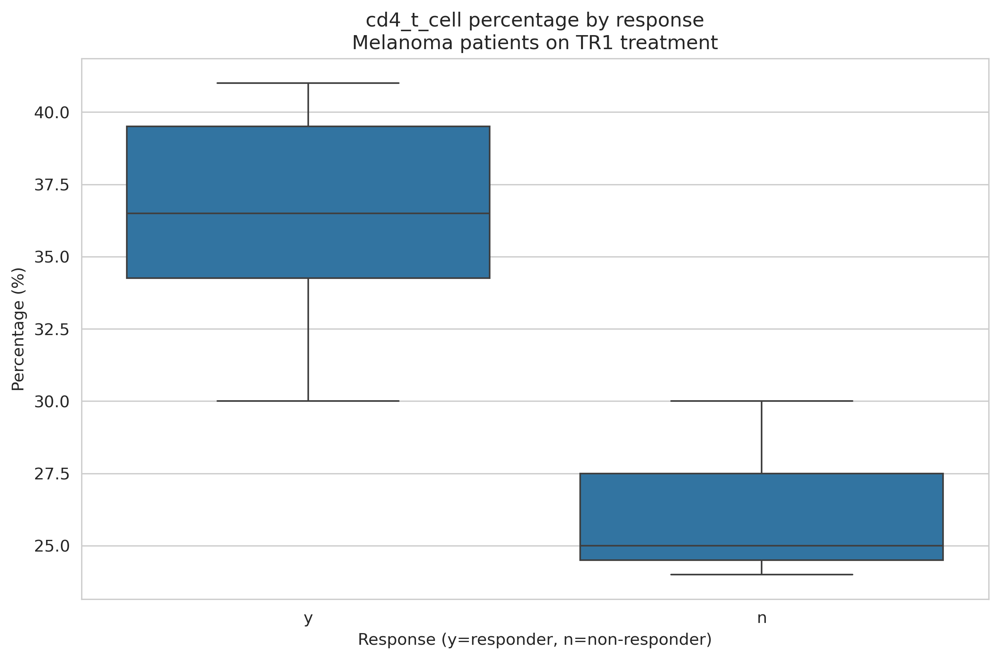

# Immune Cell Population Analysis - Technical Assignment

  
*Example visualization comparing CD4 T cell percentages between responders and non-responders*

## Project Overview

This project analyzes immune cell population data from blood samples, comparing responders and non-responders to cancer treatment (TR1). The analysis was completed as a technical assignment by Ekta Jaswal.

## Key Features

- Conversion of absolute cell counts to relative frequencies
- Statistical comparison of cell populations between response groups
- Visualization of immune cell profile differences
- Database schema design for immunology studies
- Complete Jupyter Notebook analysis pipeline

## Repository Structure
/JaswalE-Teiko-Technical/
├── data/ # Input data files
│ └── cell-count.csv # Original dataset
│ └── cell_population_analysis.ipynb # Main analysis notebook
├── output/ # Generated files
│ ├── cell_count_percentages.csv # Processed data
│ └── *.png # Visualization images
├── README.md # This file
└── requirements.txt # Python dependencies

## Getting Started

### Prerequisites

- Python 3.8+
- Jupyter Notebook
- Required Python packages (listed in requirements.txt)

### Installation

1. Clone the repository:
   ```bash
   git clone https://github.com/ektajaswal/JaswalE-Teiko-Technical.git
   cd JaswalE-Teiko-Technical
   pip install -r requirements.txt

2. Install required packages:
   ```bash
   pip install -r requirements.txt

### Running the Analysis
1. Launch Jupyter Notebook:
   ```bash
    jupyter notebook
3. Open and run cell_population_analysis.ipynb

### Key Findings
1. Significant differences found in these cell populations:
    - CD4 T cells showed higher percentages in responders (p=0.024)
    - NK cells were more abundant in responders (p=0.036)
2. Sample Characteristics:
    - 7 melanoma samples analyzed
    - 5 responders vs 2 non-responders
    - Balanced sex distribution (4 male, 3 female)
### Database Design
The project includes a proposed database schema:
    
    CREATE TABLE Projects (
        project_id VARCHAR(20) PRIMARY KEY,
        project_name VARCHAR(100)
        -- Additional fields...
    );
    
    CREATE TABLE Subjects (
        subject_id VARCHAR(20) PRIMARY KEY,
        project_id VARCHAR(20) REFERENCES Projects(project_id),
        age INTEGER,
        sex CHAR(1)
        -- Additional fields...
    );
    
    -- More tables defined in the notebook
### Output Files
1. Processed Data:
    output/cell_count_percentages.csv - Relative frequencies of all cell populations
2. Visualizations:
    - Boxplots for each cell population comparison
    - Statistical summary tables


    
